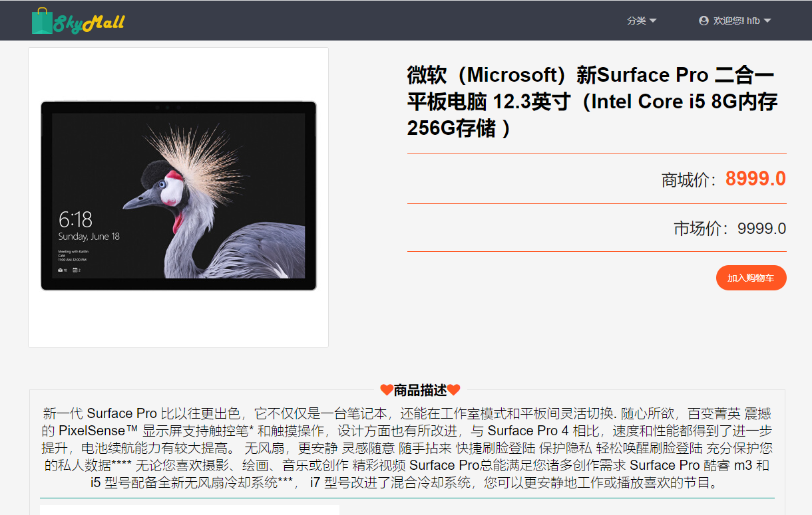
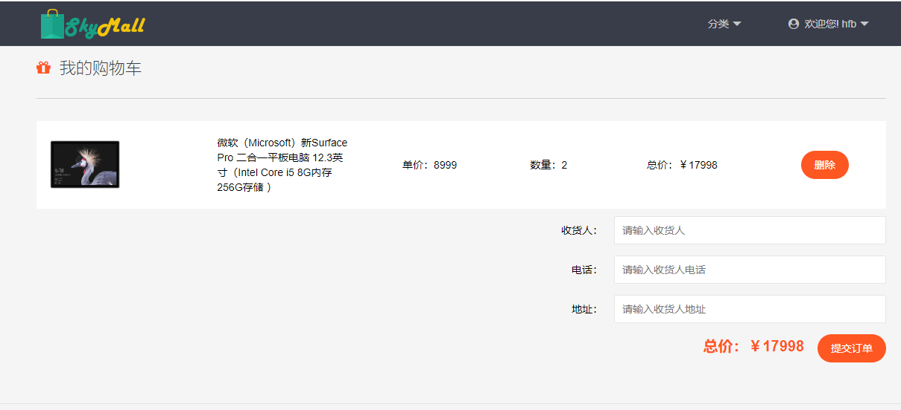
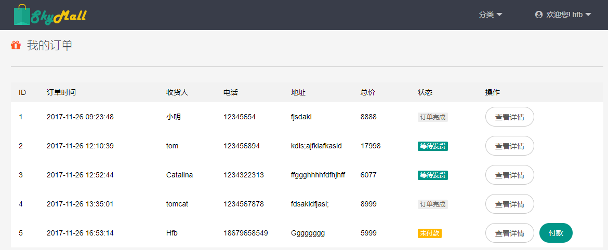
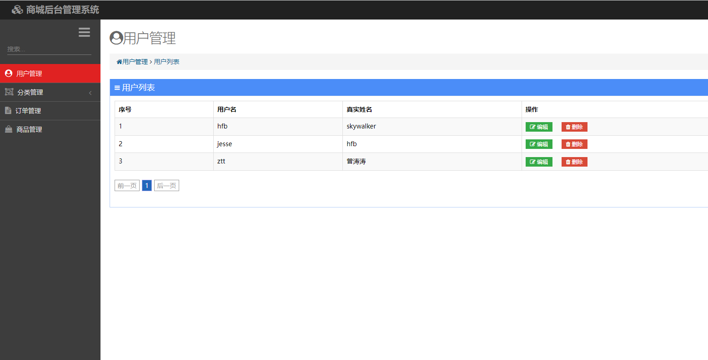
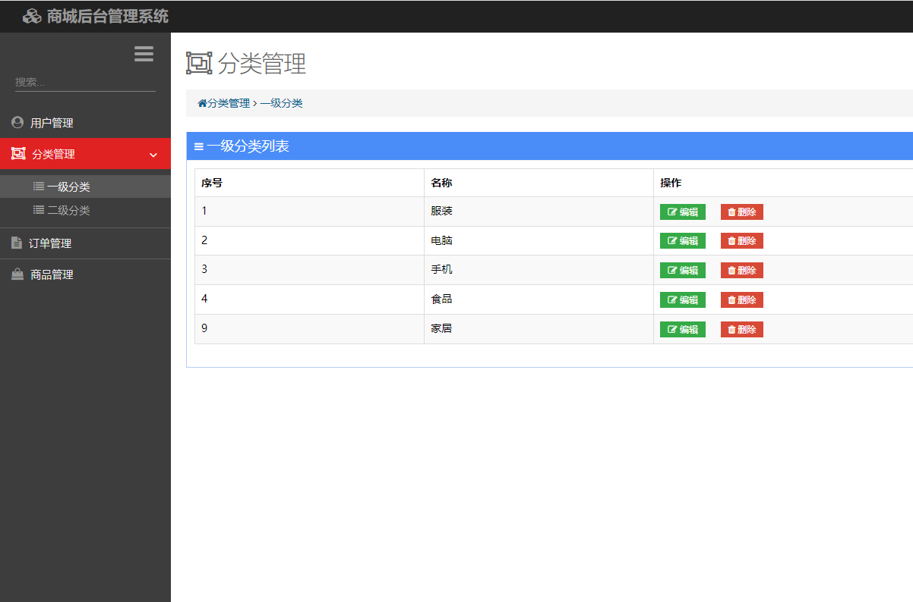
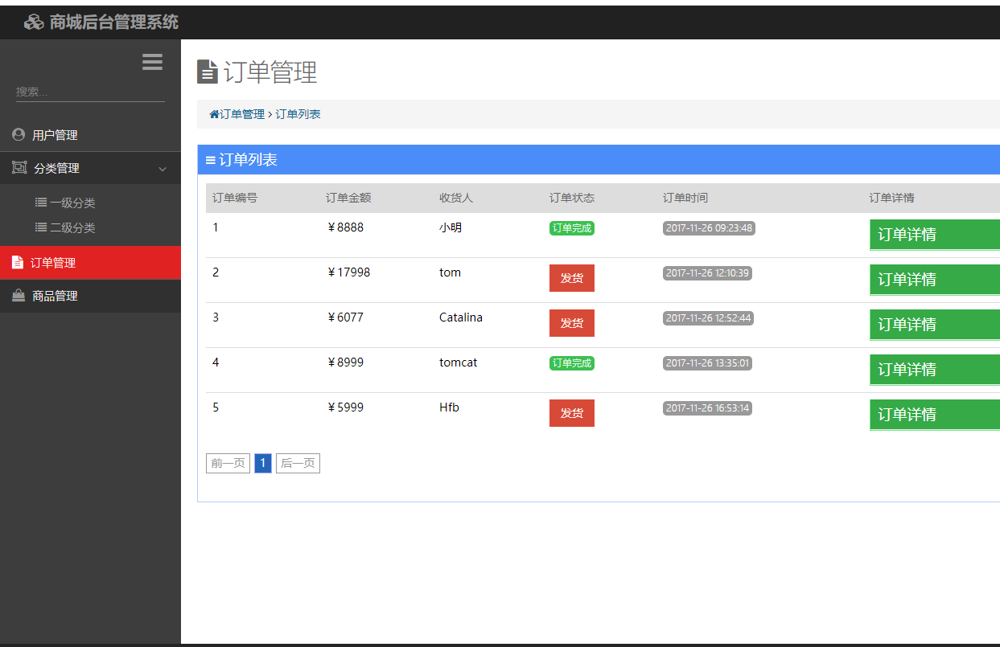
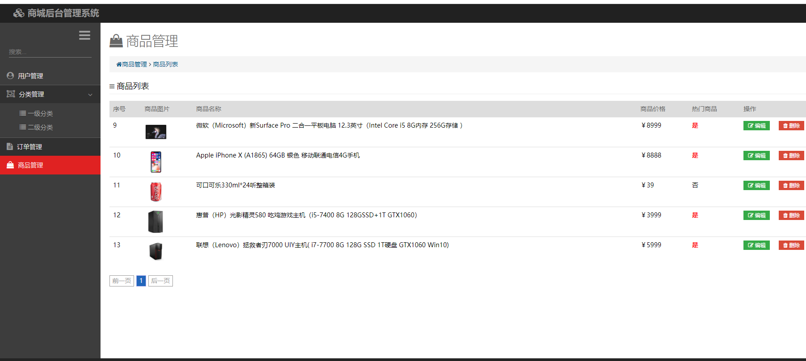

**完整代码收费 +   316595344     或    lz316595344  咨询** 

**接毕业设计和论文**

**如果图片加载不出来可以去博客看 https://blog.csdn.net/qq_56450993/article/details/133382532**

**毕业设计所有选题地址**

**[github]👉https://github.com/XinChennn/allProjects**

**[gitee]👉https://gitee.com/xinchennn/allProjects**

**[忻辰的个人博客]👉https://www.ixinjiu.cn/articles/156**

# SpringBoot网上商城

## 一、系统介绍

前台功能
商品分类查询，加入购物车，提交订单，查看订单

后台功能：
用户管理，订单管理，分类管理，商品管理

## 二、所用技术

后端技术栈：

- springboot
- jpa
- mysql

前端技术栈：

- thymeleaf

## 三、环境介绍

基础环境 :IDEA/eclipse, JDK 1.8, Mysql5.7及以上,Maven

源码+数据库脚本

所有项目以及源代码本人均调试运行无问题 可支持远程调试运行

## 四、页面截图

## 五、浏览地址

项目地址：
前台访问：http://127.0.0.1:8081/mall

用户名： hfb   密码：123456

后台访问：http://localhost:8081/mall/admin/toLogin.html

用户名： admin   密码：admin

## 六、安装教程

1. 使用Navicat或者其它工具，在mysql中创建对应名称的数据库，然后运行项目的的sql脚本（询问作者索取）；

2. 使用IDEA/Eclipse导入项目，若为maven项目请选择maven;导入成功后请执行maven clean;maven install命令，然后运行；

3. 修改 `application.properties` 里面的数据库配置

4. 启动项目后端项目

**完整代码 +   316595344     或    lz316595344  咨询** 

**接毕业设计和论文**